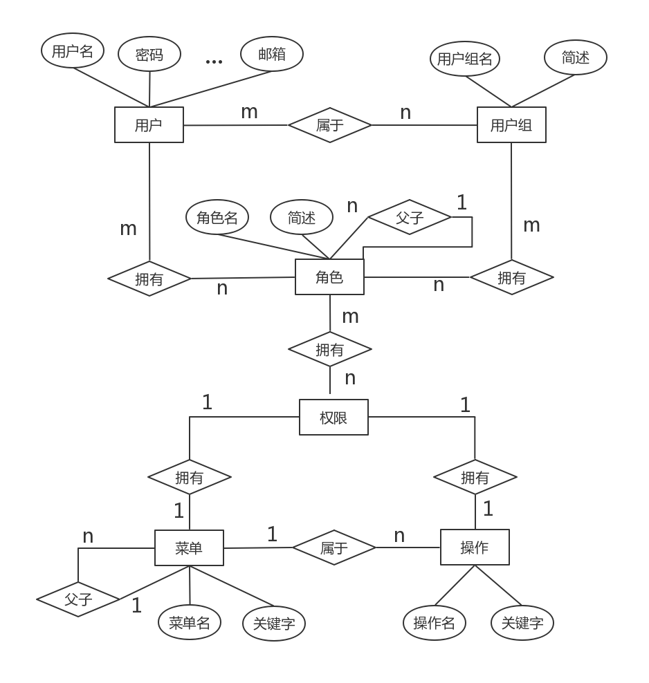

# ```rbac（Role-Based Access Control）``` 基于角色的权限访问控制

## 技术选型

- ```Spring Boot 2.1.5.RELEASE``` [一个简化Spring开发的框架](https://spring.io/)
    1. ```spring-boot-starter-web 2.1.5.RELEASE```
    2. ```spring-boot-starter-tomcat 2.1.5.RELEASE```
    2. ```spring-boot-starter-aop 2.1.5.RELEASE```
- ```Mysql 8.0.15``` [一个关系型数据库管理系统](https://www.mysql.com/)
    1. ```mysql-connector-java 8.0.16```
    2. ```mybatis 3.5.1``` [持久层框架](http://www.mybatis.org/mybatis-3/zh/index.html)
    3. ```mybatis-spring-boot-starter 2.1.5.RELEASE```
    4. ```mapper 4.1.5``` [通用mapper](https://mapperhelper.github.io/docs/)
    5. ```mapper-spring-boot-starter 2.1.5.RELEASE```
    6. ```pagehelper 5.1.8``` [MyBatis 分页插件](https://pagehelper.github.io/)
    7. ```pagehelper-spring-boot-starter 2.1.5.RELEASE```
    8. ```druid 1.1.16``` [一个数据库连接池](http://druid.io/)

- ```Redis for Windows 4.0.2.3 (alpha)``` [一个key-value存储系统](https://redis.io/)  
    windows版：[https://github.com/tporadowski/redis/releases](https://github.com/tporadowski/redis/releases)
    1. ```spring-boot-starter-data-redis 2.1.5.RELEASE```
    2. ```spring-boot-starter-cache 2.1.5.RELEASE```
    3. ```commons-pool2 2.6.2```
- 网络解析
    1. ```Gson 2.8.5``` [Java序列化/反序列化库](https://mvnrepository.com/artifact/com.google.code.gson/gson)
    2. ```spring-boot-starter-validation 2.1.5.RELEASE```
    3. ```javax.validation 2.0.1.Final```
- 工具
    1. ```lombok 1.18.8``` [一个 Java™ 实用工具](https://www.projectlombok.org/)
    2. ```hutool 4.5.9``` [一个Java工具包](https://www.hutool.cn/)
    3. ```Slf4j``` [简单日志门面](https://www.slf4j.org/)

## 软件需求

- JDK 9+
- MySQL 8.0+
- Maven 3.0+

## E-R图


## 持久层  
- 使用通用mapper生成的操作类
- 针对各种外键关联的复杂查询操作，使用原生 ```Mybatis + XML``` 编写。

## 业务层
- 基本 ```CRUD``` 操作
- 各种外键关联的复杂查询操作

## 表现层
- ```RESTful``` 风格的接口

## 未完成扩展

- ```RESTful``` 文档编写
- ```List``` 去重优化
- 项目打包