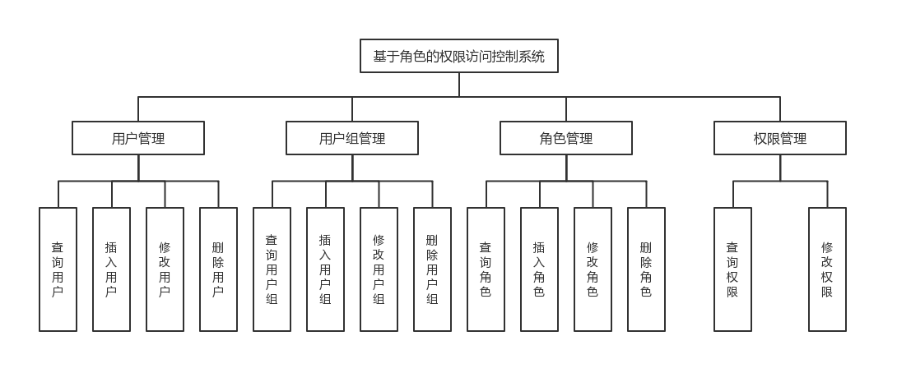
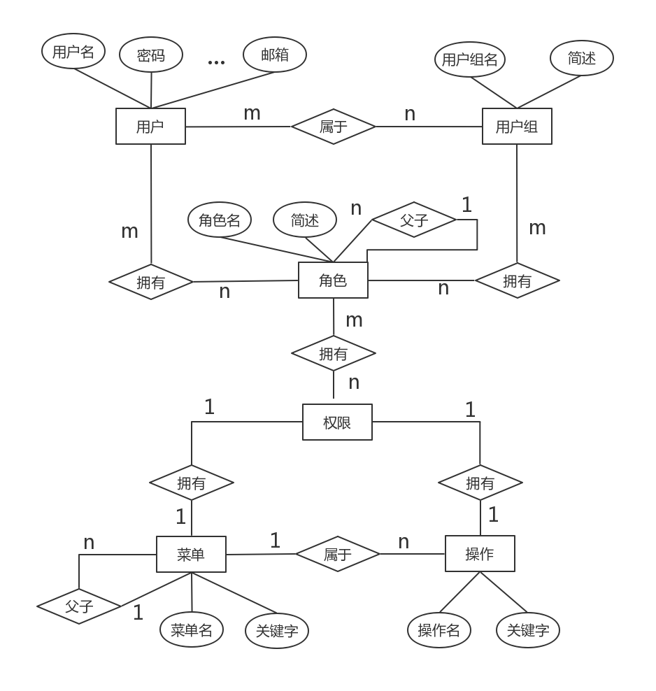

# ```rbac（Role-Based Access Control）``` 基于角色的权限访问控制

## 功能设计


## E-R图


## 持久层  
- 使用通用mapper生成的操作类
- 针对各种外键关联的复杂查询操作，使用原生 ```Mybatis + XML``` 编写。

## 业务层
- 基本 ```CRUD``` 操作
- 各种外键关联的复杂查询操作

## 表现层
- ```RESTful``` 风格的接口

## 未完成扩展
- ```RESTful``` 文档编写
- ```List``` 去重优化
- 项目打包